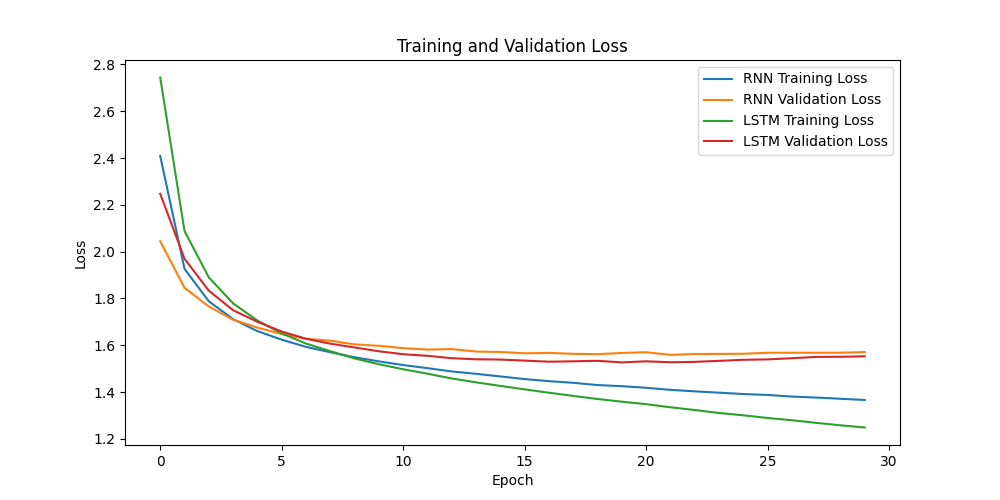

# Language Modeling Report

In this report, we present the implementation and evaluation of character-level language models using vanilla RNN and LSTM architectures. We adhere to the requirements outlined for the project.

## 1. Dataset Pipeline (`dataset.py`)

We implemented a custom dataset pipeline in `dataset.py` to provide data to our models. This pipeline loads and preprocesses the Shakespeare dataset. Specifically, it constructs a character dictionary and creates sequences of length 30, splitting the data into chunks with appropriate target sequences.

## 2. Model Implementation (`model.py`)

We implemented both vanilla RNN and LSTM models in `model.py`. For both architectures, we stacked multiple layers (2 in main.py) to explore if it improves performance. The implementation follows the instructions provided in the file as comments.

We set the following hyper parameters as follows

batch_size = 64
seq_length = 30
hidden_size = 128
num_layers = 2
lr = 0.002
epochs = 30

## 3. Training Script (`main.py`)

The `main.py` script is responsible for training our models. During training, we monitor the training process using average loss values of both training and validation datasets. We utilized torch's CrossEntropyLoss as our cost function and employed the Adam optimizer.

## 4. Evaluation and Reporting (report)

We plotted the average loss values for both training and validation datasets to evaluate the performance of our models. Additionally, we compared the language generation performances of vanilla RNN and LSTM models in terms of loss values for the validation dataset. This comparison helps us assess which model architecture performs better for this task.

As the result of the experiment, the LSTM outperforms the RNN. The following graph depicts the lapse of each model at every epoch.

Traning loss:
RNN starts with less loss over LSTM. However, LSTM's loss reduces near the epoch 7 (see the graph line blue(RNN) and LSTM(Green))
They both keep decreasing as further epochs are iterated

Validation loss:
RNN starts with less loss over LSTM. However, LSTM's loss reduces near the epoch 6 (see the graph line Orange(RNN) and LSTM(Red))
The RNN loss converges around the loss 1.6 unlike the that of LSTM which slightly increases after the epoch 19

## 5. Character Generation (`generate.py`)

We implemented character generation functionality in `generate.py` using the trained model with the best validation performance. We selected the model that exhibited the lowest validation loss. The script generates at least 100 characters of 5 different samples from different seed characters.

## 6. Softmax Function with Temperature Parameter (Report)

The softmax function with a temperature parameter T can be written as:
<be>

$$
y_i = \frac{e^{z_i / T}}{\sum_{j} e^{z_j / T}}
$$

 

We experimented with different temperatures when generating characters and observed their impact on the generated results. In our analysis, we discuss how varying the temperature affects the plausibility and diversity of the generated text.

 

The samples are the Shakespeare lines that we experimented for kindly see the results of each sample with different temperatures 0.2, 0.5, 0.8, 1.0, 1.2
  
Sample1: "He cannot temperately transport his honours",
 
Sample2: "Were he to stand for consul, never would he",
 
Sample3: "We have power in ourselves to do it,",
 
Sample4: "Good night, good night! parting is such sweet sorrow,",
 
Sample5: "And with thy scorns drew'st rivers from his eyes"

 

### Analysis
It appears that the generated texts at temperature 0.2 are more plausible. As it corresponds to grammar structures more precisely, they are more readable.
Yet, the meanings of the results are quite not corresponding to the original seed characters. 
The low-temperature hyper parameter plays a role of keeping the general sentence structures in the provided corpus
 
On the other hand, the sentence structures are broken by using high temperatures. 
It may disturb the influence of the predicted result (z_i) and cause a model to explore the creative structures and words that were not trained
 
These are some results at different temperatures to check the plausibility of generated texts
  
Sample 1
 
Original characters:  He cannot temperately transport his honours

  

at temperature  0.2
  
generated_text:
  
to the people, 
That I must not the common the people and the people and the people and the many tha
  

at temperature  1.5
  
generated_text:
  
They we coupsuace in the spidedio't, 
Est wife 
A spary; and I muse nay; we'lcker lip night, 
Whose na
